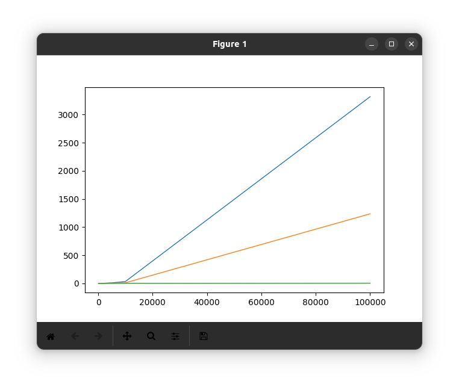

# Отчет о проделанной работе

## Пузырьковая сортировка
Число объектов | Время сортировки (сек)
---|---
100 000 | 3316.47
10 000 | 32.775
5 000 | 8.07
2 000 | 1.292
1 000 | 0.323
500 | 0.081
100 | 0.003

## Простыми вставками сортировка
Число объектов | Время сортировки (сек)
---|---
100 000 | 1234.73
10 000 | 9.681
5 000 | 2.424
2 000 | 0.384
1 000 | 0.096
500 | 0.024
100 | 0.001

## Пирамидальная сортировка
Число объектов | Время сортировки (сек)
---|---
100 000 | 2.209
10 000 | 0.151
5 000 | 0.071
2 000 | 0.024
1 000 | 0.01
500 | 0.004
100 | 0.000001

## Визуализация результатов
По оси X - объем элементов, по оси Y - время сортировки

- Синяя линия - пузырьковая сортировка
- Оранжевая - сортировка вставками
- Зеленая - пирамидальная

